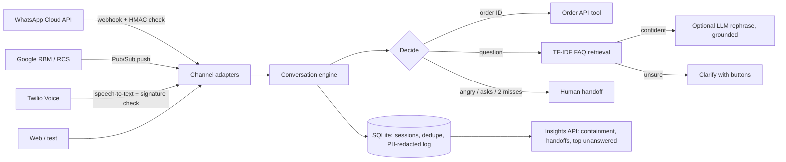

# Brand Assistant: one AI assistant, every channel

A multi-brand customer assistant that runs on **WhatsApp**, **RCS** and **voice** from a single conversation engine. Each brand (client) is configured in one YAML file: persona, FAQ knowledge base, menu, order-ID format and handoff rules. No code changes are needed to onboard a new brand.

Built to mirror how conversational-AI teams deploy assistants for enterprise brands: integrate the channel, own the prompts and knowledge base, launch, then use the analytics to grow what the client uses.



## What it does

| Capability | How |
|---|---|
| **3 channels, 1 engine** | WhatsApp (text + reply buttons), RCS (suggestion chips), voice (Twilio TwiML `<Gather>` speech loop). Each adapter converts platform payloads to `handle(brand, user, channel, text)` and back. |
| **Multi-brand** | `brands/*.yaml`. Two demo brands included: a grocery app and a telecom. Knowledge bases are isolated per brand. |
| **Order tracking with slot filling** | "Where's my order?" → asks for the ID → looks it up on the next turn. Releases the slot if the user changes topic. |
| **FAQ answers that don't guess** | TF-IDF (word + character n-grams for typos) with two thresholds: answer, ask a "Did you mean…" question with buttons, or fall back. Common Hinglish/chat shorthand (`kab`, `milega`, `cod`, `pls`) is normalised. |
| **Optional LLM, never required** | If `LLM_API_KEY` is set, answers are rephrased by any OpenAI-compatible model (OpenAI, Groq, Gemini) **using only the approved FAQ text**. If the model is down or says the context doesn't cover it, the approved answer is sent instead. |
| **Human handoff** | On request ("agent", "customer care"), on frustration ("useless"), or after 2 consecutive misses. Chat users are held in a queue; voice calls are transferred with `<Dial>`. |
| **Production hygiene** | Webhook signature verification (WhatsApp HMAC-SHA256, Twilio HMAC-SHA1), idempotent handling of retried webhooks, fast 200 + background send for WhatsApp, PII redaction (phones, emails, card numbers) before logging, per-channel length limits, 30-minute session expiry. |
| **Account insights** | `GET /brands/{id}/insights`: conversations, containment rate, handoff rate, fallback rate, p95 latency, usage by channel, top intents, and the **top unanswered questions** (the list to grow the knowledge base from). |

## Results

Routing was evaluated offline on hand-labelled messages written to be different from the FAQ wording, including typos, Hinglish and out-of-scope requests (`eval/`). Thresholds were tuned on the **dev** set only; the **test** set is held out.

| Metric (held-out test set, n = 48) | Score |
|---|---|
| Correct FAQ answered directly | **83.3%** (25 / 30) |
| Correct FAQ answered or offered as a clarify button | **93.3%** (28 / 30) |
| Precision when the bot answers | **96.2%** |
| Wrong-answer rate (answered with the wrong policy) | **3.3%** (1 / 30) |
| Out-of-scope messages correctly not answered | **77.8%** (7 / 9) |
| Order-status, handoff and greeting flows | **100%** (9 / 9) |

The design deliberately trades some coverage for a low wrong-answer rate: telling a customer the wrong refund policy is worse than asking a clarifying question.

**Transparency note:** the first test run scored 80.0% / 96.0% / 3.3%. One miss ("when is my bill due" scoring 0) exposed a bug: scikit-learn's built-in stop-word list contains "bill". It was replaced with a hand-written list and the test set was re-run once. No other changes were made after looking at test results.

**Known misses** (`python -m eval.run_eval` prints them): "how do i make biryani" matched the cancel-order FAQ, and "stock price" matched the membership FAQ. Both are lexical false positives that sentence embeddings or the LLM's `NOT_FOUND` check would catch.

## Run it

```bash
pip install -r requirements.txt

python -m scripts.chat kirana-express             # chat in the terminal, no keys needed
python -m scripts.chat nimbus-telecom --channel voice

pytest -q                                         # 41 tests
python -m eval.run_eval                           # routing metrics on the held-out set
python -m eval.run_eval --sweep                   # threshold grid search on dev

uvicorn app.main:app --reload                     # API docs at http://localhost:8000/docs
```

Or with Docker: `docker build -t brand-assistant . && docker run -p 8000:8000 --env-file .env brand-assistant`

### Connect a real WhatsApp number (free test number)
1. Create an app at developers.facebook.com, add the **WhatsApp** product, and copy the temporary token and test phone number ID.
2. Expose your server: `ngrok http 8000`.
3. Webhook URL: `https://<ngrok-id>.ngrok.app/webhooks/whatsapp/kirana-express`, verify token = `WHATSAPP_VERIFY_TOKEN`. Subscribe to `messages`.
4. Put `WHATSAPP_TOKEN` and `WHATSAPP_APP_SECRET` in `.env` and set the brand's `phone_number_id`.

### Connect voice (Twilio trial)
Set the phone number's "A call comes in" webhook to `https://<ngrok-id>.ngrok.app/webhooks/voice/kirana-express` (HTTP POST) and put `TWILIO_AUTH_TOKEN` in `.env`.

### RCS
`/webhooks/rcs/{brand}` accepts Google RBM Pub/Sub push events and returns the `contentMessage` body to send. Sending needs a Google RBM service account, so delivery is left to the RBM client library.

## Add a brand
Copy `brands/kirana-express.yaml`, change the persona, FAQs and order-ID pattern, then add a few labelled lines to `eval/dev.jsonl` and run the eval. After launch, review `top_unanswered` in the insights report and add those questions as FAQ examples.

## API

| Method | Path | Purpose |
|---|---|---|
| GET | `/health` | Status, loaded brands, LLM on/off |
| POST | `/chat/{brand}` | JSON chat endpoint for testing / web widget |
| GET, POST | `/webhooks/whatsapp/{brand}` | Meta verification and inbound messages |
| POST | `/webhooks/rcs/{brand}` | RBM inbound events |
| POST | `/webhooks/voice/{brand}` | Twilio call turns, returns TwiML |
| GET | `/brands/{brand}/insights` | Account metrics |

## Project layout
```
app/engine.py        decision logic shared by all channels
app/knowledge.py     normalisation + TF-IDF retrieval
app/channels/        whatsapp.py, rcs.py, voice.py (parse, verify, format)
app/store.py         SQLite sessions, dedupe, redacted log, insights
app/llm.py           optional grounded rephrasing with safe fallback
app/main.py          FastAPI routes
brands/              one YAML per client
eval/                dev/test sets and evaluation script
tests/               unit, channel and API tests
```

## Limitations and next steps
- Channel adapters are tested against the documented payload formats and signature schemes, not yet against a production WhatsApp Business account.
- TF-IDF matches words, not meaning. Next step: sentence embeddings (e.g. `all-MiniLM-L6-v2`) with the same thresholds, compared on the same eval sets.
- Handoff holds chat users in a queue but does not yet push the conversation to an agent inbox (e.g. a Freshdesk/Zendesk ticket).
- Single-process SQLite; move to Postgres + Redis for sessions at scale.
