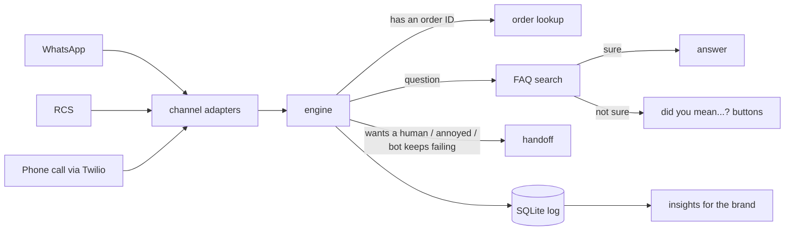

# brand-assistant

A customer support bot for brands that works on WhatsApp, RCS and phone calls, all from the same code.

I wanted to understand how companies actually run AI assistants for lots of different brands at once. The bot itself is only part of it. You also have to deal with each messaging platform's webhooks, stop the bot from making up refund policies, hand angry customers to a human, and show the brand whether the bot is helping at all. So I built a small version of that whole setup.

There are two made-up brands in `brands/` to test with: **Kirana Express** (grocery delivery) and **Nimbus Telecom** (mobile and broadband). Each brand is just a YAML file, so adding a third one doesn't need any code changes.

## How it works

Every channel gets converted into the same simple call: *this brand, this user, this message*. The engine decides what to do, and the channel code turns the reply back into whatever format WhatsApp, RCS or Twilio expects.



For each message the engine checks things in this order:

1. Have I seen this message ID already? WhatsApp retries webhooks, so duplicates get ignored.
2. Is this person already waiting for a human? Then don't jump back in.
3. Are they asking for an agent, or clearly annoyed ("this bot is useless")? Hand off.
4. Is it just "hi" or "thanks"? Reply and show the menu.
5. Does it contain an order ID like `KE10231`? Look it up. If they ask "where's my order?" without one, ask for it and remember that on the next message.
6. Otherwise search the brand's FAQs.

## The part I spent the most time on: not giving wrong answers

A support bot that confidently gives the wrong refund policy is worse than no bot. So the FAQ search has two cutoffs instead of one:

- **score ≥ 0.40**: answer it
- **0.25 to 0.40**: ask "did you mean one of these?" with buttons
- **below 0.25**: say it didn't understand. If that happens twice in a row, pass the user to a human.

The search is TF-IDF on both words and character chunks, so typos like "refnd" or "coupn" still match. Indian users mix Hindi into chat a lot, so there's a small dictionary that maps words like *kab*, *milega* and *kahan* (and shorthand like *cod*, *pls*) to English before searching.

An LLM is optional. If you set an API key, it rewrites the FAQ answer so it sounds more natural, but it's only allowed to use the FAQ text. If the API is down, slow, or replies that the FAQ doesn't cover the question, the bot just sends the original FAQ answer. The bot works with no key at all.

## How well it works

I wrote two sets of test messages by hand, worded differently from the FAQs and including typos, Hinglish and off-topic stuff like "write me a poem":

- `eval/dev.jsonl` (34 messages) is what I tuned the thresholds and FAQ examples on.
- `eval/test.jsonl` (48 messages) I kept aside and only ran at the end.

Results on the test set:

| | |
|---|---|
| FAQ questions answered correctly | 25 / 30 (83%) |
| ...or the right answer offered as a button | 28 / 30 (93%) |
| When it answers, how often it's right | 96% |
| Answered with the wrong FAQ | 1 / 30 (3.3%) |
| Off-topic messages it correctly didn't answer | 7 / 9 |
| Order tracking, handoff and greeting flows | 9 / 9 |

**One honest note:** my first run on the test set got 80% instead of 83%. Looking at the misses, "when is my bill due" scored exactly 0. It turned out scikit-learn's built-in stop-word list includes the word "bill" (and also "call", "back" and "system", which is bad for a telecom bot). I replaced it with my own list and re-ran the test set once. I didn't change anything else after seeing test results.

It still gets some things wrong. "how do i make biryani" matches the cancel-order FAQ, and "what is the stock price today" matches the membership one. That's the limit of matching on words instead of meaning. Run `python -m eval.run_eval` to see every miss.

## Running it

```bash
pip install -r requirements.txt

# talk to the bot in your terminal (no API keys needed)
python -m scripts.chat kirana-express
python -m scripts.chat nimbus-telecom --channel voice

# tests and evaluation
pytest -q
python -m eval.run_eval                 # held-out test set
python -m eval.run_eval --split dev
python -m eval.run_eval --sweep         # try different thresholds on the dev set

# start the API (docs at http://localhost:8000/docs)
uvicorn app.main:app --reload
```

Keys go in a `.env` file. Copy `.env.example` and fill in only what you need; everything is optional.

Docker also works: `docker build -t brand-assistant . && docker run -p 8000:8000 --env-file .env brand-assistant`

### Hooking up real WhatsApp

Meta gives you a free test number, which is enough to try this on your own phone.

1. Make an app on developers.facebook.com and add WhatsApp to it. Copy the temporary access token and the phone number ID.
2. Run `ngrok http 8000` so Meta can reach your laptop.
3. Set the webhook URL to `https://<your-ngrok-url>/webhooks/whatsapp/kirana-express` and the verify token to whatever you put in `WHATSAPP_VERIFY_TOKEN`. Subscribe to `messages`.
4. Put `WHATSAPP_TOKEN` and `WHATSAPP_APP_SECRET` in `.env`, and the phone number ID in the brand's YAML.

### Phone calls

With a Twilio trial number, set "A call comes in" to `https://<your-ngrok-url>/webhooks/voice/kirana-express` (POST) and add `TWILIO_AUTH_TOKEN` to `.env`. Twilio turns speech into text, the bot replies, and Twilio reads the reply out. If the caller asks for a person, the call gets transferred to the number in the brand's config.

### RCS

`/webhooks/rcs/{brand}` reads Google's RCS Business Messaging events and builds the reply. I didn't do the sending part, because that needs a Google service account, which I don't have.

## Things I made sure to handle

These aren't exciting, but a real deployment breaks without them:

- **Checking webhooks are real.** WhatsApp signs requests with HMAC-SHA256 and Twilio with HMAC-SHA1. Requests with a bad signature get a 401.
- **Duplicate messages.** Each message ID is stored, so a retried webhook doesn't make the bot reply twice.
- **Replying fast to WhatsApp.** The webhook returns right away and the actual reply is sent in the background, otherwise Meta thinks the request failed and retries.
- **Personal info.** Phone numbers, emails and card numbers are masked before anything is saved.
- **Channel limits.** WhatsApp allows 3 buttons with 20-character titles, and RCS chips allow 25 characters. Voice replies are cut to two sentences, since nobody wants to listen to a paragraph.
- **Sessions expire** after 30 minutes, so someone coming back the next day doesn't get stuck mid-conversation.

## Insights for the brand

`GET /brands/{brand}/insights` returns how many conversations the bot handled on its own, how often it handed off to a human, how often it gave up, response time, and usage by channel.

The most useful part is **top unanswered questions**. It's basically a to-do list for what to add to the FAQs next.

## Adding a new brand

Copy `brands/kirana-express.yaml`, change the persona, FAQs and order-ID format, add some test messages to `eval/dev.jsonl`, and run the eval to check nothing is badly off.

## Folder structure

```
app/engine.py        decides what to do with each message
app/knowledge.py     FAQ search + Hinglish/typo handling
app/channels/        whatsapp.py, rcs.py, voice.py
app/store.py         SQLite: sessions, duplicate check, logs, insights
app/llm.py           optional LLM rewording
app/main.py          FastAPI routes
brands/              one YAML file per brand
eval/                test messages + evaluation script
tests/               41 tests
scripts/chat.py      terminal chat
```

## What's missing / what I'd do next

- I've tested the channel code against Meta's and Twilio's documented formats, but not on a live business account yet.
- Swapping TF-IDF for sentence embeddings would fix the "biryani" type mistakes. The eval sets are already there to compare the two fairly.
- Handoff currently just parks the user. A real version would create a ticket in something like Freshdesk or Zendesk so an agent actually sees it.
- SQLite is fine for a demo. For real traffic I'd move to Postgres, with Redis for sessions.
